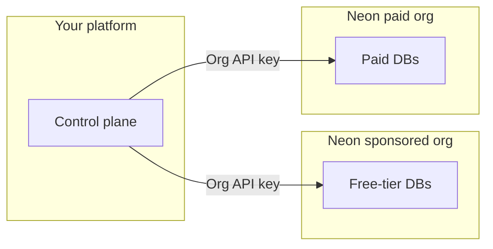

# Neon for Agent Platforms

Sample TypeScript for Neon’s **Management API** and a **companion Agent Skill** for the [Neon AI Agent Program](https://neon.com/use-cases/ai-agents). Use this repo when your product **provisions and operates Neon Postgres for end users** (agent platforms, codegen tools, multi-tenant SaaS).

**Scope:** control-plane and fleet patterns: orgs, provisioning, branching, snapshots, transfer, consumption. For drivers, connection strings, ORMs, and everyday Neon app integration, install `**neon-postgres`** first and read [Neon docs](https://neon.com/docs); use this repo for Agent Program orchestration and fleet workflows.

Official Neon docs: [Agent Plan](https://neon.com/docs/introduction/agent-plan), [AI Agent integration](https://neon.com/docs/guides/ai-agent-integration), [Database versioning](https://neon.com/docs/ai/ai-database-versioning).

---

## Start here (Agent Program partners)

**Install** the Agent Skills below, then **run** the samples under `[scripts/](scripts/)`. Details: [Install the companion skill](#install-the-companion-skill) · [Example scripts](#example-scripts).

### Install the companion skill

In Cursor, Claude Code, or any environment that supports [Agent Skills](https://agentskills.io/specification), install the general Neon skill **before** this companion:

```bash
npx skills add neondatabase/agent-skills -s neon-postgres
npx skills add neondatabase/agent-skills -s neon-postgres-agent-platforms
```

`**neon-postgres**` covers Auth, drivers, branching tutorials, Data API, MCP, and core Postgres-on-Neon guidance. `**neon-postgres-agent-platforms**` adds Agent Program context: dual-org fleets, project transfer, per-tenant provisioning, compound checkpoints, consumption **v2**, and pointers to the runnable samples in `[scripts/](scripts/)`.

The skill package includes `**SKILL.md`** plus `**references/`** (long-form docs and **symlinked copies** of every `**scripts/*.ts`** source so assistants can read examples without leaving the skill folder).

### Example scripts

Runnable samples live under `**[scripts/](scripts/)`** as `**.ts` sources**. **There** is **no compile step** or emitted JavaScript. From that directory, `**npm install`** adds **[tsx](https://github.com/privatenumber/tsx)**; each `**npm run …`** in `**[scripts/package.json](scripts/package.json)`** runs the matching `**.ts`** file with `**tsx`** (see `**package.json**` scripts). Scripts use `**import "dotenv/config"**` so `**.env**` loads automatically.

**Neon TypeScript SDK** here means `**[@neondatabase/api-client](https://www.npmjs.com/package/@neondatabase/api-client)`** only (Neon Management API), not other Neon npm packages.

Full script catalog, env vars, and npm shortcuts: **[MANAGEMENT_API_SAMPLES.md](skills/neon-postgres-agent-platforms/references/MANAGEMENT_API_SAMPLES.md)**.

```bash
git clone https://github.com/neondatabase/neon-for-agent-platforms.git
cd neon-for-agent-platforms/scripts
npm install
cp .env.example .env
# Set NEON_API_KEY (see .env.example)

npm run neon:list-projects
npm run branch -- list
npm run consumption
npm run auth-users -- meta
npm run versioning-flow   # NEON_API_KEY + NEON_PROJECT_ID in .env
```

---

## Fleet and org model (summary)

Partners typically run **two Neon organizations** so free-tier users and paying customers land in separate pools. Your control plane picks **which org** when creating a tenant project; upgrades often mean [transferring](https://neon.com/docs/manage/orgs-project-transfer) into the paid org and raising quotas. Use **organization API keys** per org and a **personal API key** for cross-org transfer. Neon recommends **one Neon project per customer app**.


| Org                    | Typical role                                                                               |
| ---------------------- | ------------------------------------------------------------------------------------------ |
| **Sponsored free org** | Free-tier end users (within program rules on [neon.com](https://neon.com))                 |
| **Paid org**           | Paying customers (metered per [Agent Plan](https://neon.com/docs/introduction/agent-plan)) |





How scripts map to these flows: **[MANAGEMENT_API_SAMPLES.md](skills/neon-postgres-agent-platforms/references/MANAGEMENT_API_SAMPLES.md)** and the [AI Agent integration guide](https://neon.com/docs/guides/ai-agent-integration). For checkpoints beyond Neon IDs, see **[Compound checkpoints](skills/neon-postgres-agent-platforms/references/COMPOUND_CHECKPOINTS_FOR_AGENT_PLATFORMS.md)**.

---

## Repository layout

This repo keeps two application directories plus this `**README.md`** at the root ([Agent Skills layout](https://agentskills.io/home#what-are-agent-skills)):

```
neon-for-agent-platforms/
├── README.md                          # You are here
├── scripts/                           # *.ts source (run via tsx), utils.ts, package.json, tsconfig.json, .env.example
└── skills/neon-postgres-agent-platforms/
    ├── SKILL.md
    └── references/                    # Docs + symlinked *.ts (same sources as scripts/)
```


| Path                                                                               | Purpose                                                                                                                                                                                                                                                    |
| ---------------------------------------------------------------------------------- | ---------------------------------------------------------------------------------------------------------------------------------------------------------------------------------------------------------------------------------------------------------- |
| **[scripts/](scripts/)**                                                           | `[@neondatabase/api-client](https://www.npmjs.com/package/@neondatabase/api-client)` samples. Run `**npm install`** inside `**scripts/`**; see **[MANAGEMENT_API_SAMPLES.md](skills/neon-postgres-agent-platforms/references/MANAGEMENT_API_SAMPLES.md)**. |
| **[skills/neon-postgres-agent-platforms/](skills/neon-postgres-agent-platforms/)** | Companion skill ([SKILL.md](skills/neon-postgres-agent-platforms/SKILL.md)); `**references/`** holds detailed docs and symlinked `***.ts`** sources for agents.                                                                                            |


---

## Reference


| Resource                                                                                               | Notes                                       |
| ------------------------------------------------------------------------------------------------------ | ------------------------------------------- |
| [MANAGEMENT_API_SAMPLES.md](skills/neon-postgres-agent-platforms/references/MANAGEMENT_API_SAMPLES.md) | Catalog, env vars, flows                    |
| [references/README.md](skills/neon-postgres-agent-platforms/references/README.md)                      | Index of symlinked scripts + reference docs |
| [SKILL.md](skills/neon-postgres-agent-platforms/SKILL.md)                                              | Companion skill for assistants              |
| [Agent Skills repo](https://github.com/neondatabase/agent-skills)                                      | `neon-postgres` bundle                      |
| [AI Agent Platforms](https://neon.com/use-cases/ai-agents)                                             | Program overview                            |
| [API reference](https://api-docs.neon.tech)                                                            | Management API                              |


**Requirements:** Node **20+** recommended (`node --env-file=.env`). [Neon API key](https://neon.com/docs/manage/api-keys) (`NEON_API_KEY`). Org-scoped keys often need `NEON_ORG_ID` (see **MANAGEMENT_API_SAMPLES.md**).

---

## Contributing

From `**scripts/`**: `npm install`, `npm run fmt:check`, `npm run typecheck`. Format: `npm run fmt`. See **[AGENTS.md](AGENTS.md)** (symlink to [references/AGENTS.md](skills/neon-postgres-agent-platforms/references/AGENTS.md)).

---

## Support

- Agent Program: shared Slack with Neon
- [agents@neon.tech](mailto:agents@neon.tech) for limits and account requests (include org IDs)
- [HIPAA on Neon](https://neon.com/docs/security/hipaa) (Agent Plan)
- [neon.com/docs](https://neon.com/docs)

## License

Apache 2.0. See **[LICENSE](skills/neon-postgres-agent-platforms/references/LICENSE)**.