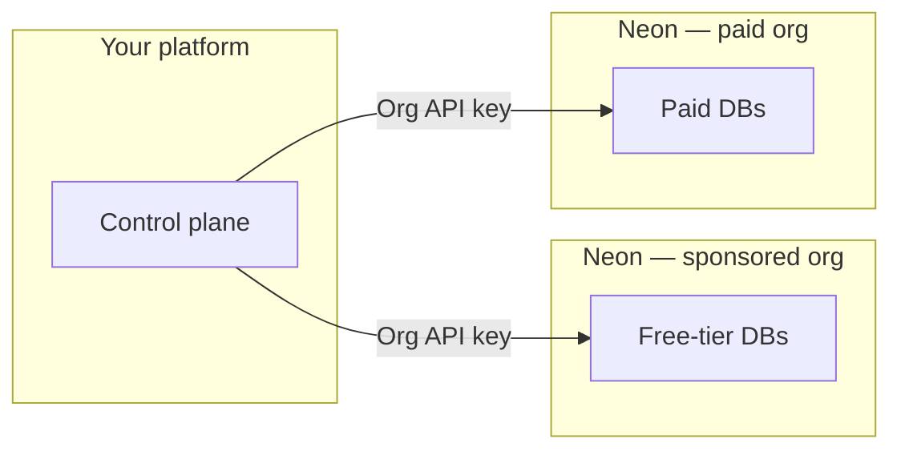

# Neon for Agent Platforms

Sample code and a companion skill for the **[Neon AI Agent Program](https://neon.com/use-cases/ai-agents)**—for products that **provision and operate Neon Postgres on behalf of their users** (for example: agent platforms, codegen tools, multi-tenant SaaS). The companion skill follows the open **[Agent Skills](https://agentskills.io/home)** format ([specification](https://agentskills.io/specification)); this repo adds **runnable `examples/`** next to that skill for partners.

**Scope:** control-plane and fleet patterns—orgs, provisioning at scale, branching and snapshots/versioning, project transfer, consumption/metering, orchestration hooks, and safe mutation of user-owned Neon resources—not introductory Neon usage. **Connection strings, drivers, Drizzle/ORM setup, generic branching tutorials, and everyday Neon Auth application integration** belong in the **`neon-postgres`** skill and **[Neon docs](https://neon.com/docs)**; install **`neon-postgres`** first, then use this repo for Agent Program–specific orchestration.

**Official Neon docs (pricing, limits, product behavior):** [neon.com](https://neon.com) — **[Agent Plan](https://neon.com/docs/introduction/agent-plan)** · **[AI Agent integration](https://neon.com/docs/guides/ai-agent-integration)** · **[Database versioning](https://neon.com/docs/ai/ai-database-versioning)**.

---

## Start here (Agent Program partners)

Use this section first after Neon accepts you into the program. Sections below add detail and reference links.

### 1. Accounts, orgs, and keys

Agent Program partners typically use **two Neon organizations** (free-tier users vs paying customers). Store **both org IDs**, **organization API keys** for automation inside each org, and a **personal API key** for **[project transfer](https://neon.com/docs/manage/orgs-project-transfer)** between orgs. Follow **[Before you begin](https://neon.com/docs/guides/ai-agent-integration)** in the integration guide.

### 2. Common product shapes

Two recurring shapes; **script names and env vars** are in **[examples/api-scripts/MANAGEMENT_API_SCRIPTS.md](examples/api-scripts/MANAGEMENT_API_SCRIPTS.md)**.

- **Embedded Postgres in your product** (sandboxes, previews, agent workspaces): provision with **create-project**, branch with **branch**, undo/time-travel with **versioning-flow** / **snapshot** / **restore-snapshot**, delete with **delete-project** (npm scripts — see [Management API scripts](examples/api-scripts/MANAGEMENT_API_SCRIPTS.md)).
- **One Neon project per generated or customer app**: same scripts; align naming and lifecycle with Neon’s **[AI Agent integration guide](https://neon.com/docs/guides/ai-agent-integration)**.

**Auth vs Postgres roles vs consumption:** [Neon Auth](https://neon.com/docs/neon-auth/api) (app users under `…/auth/users`) is not [Postgres roles](https://neon.com/docs/manage/users) (connection users) or [consumption / billing metrics](https://neon.com/docs/guides/consumption-metrics). Run **`auth-users.ts meta`** for a short routing summary.

For fleet **two-org** patterns (create → transfer → consume → delete), see **[Fleet provisioning and org layout](#fleet-provisioning-and-org-layout)** below.

### 3. Clone and run the examples

Source lives under **`examples/api-scripts/scripts/`** as TypeScript. **`npm run build`** runs **`tsc`**, which writes **`dist/*.js`** — you then run those files with **`node dist/...`** (no `tsx`; see **`examples/api-scripts/package.json`**). Scripts use **`import "dotenv/config"`**, so a local **`.env`** is loaded automatically.

**This fork (`sav-maya`) may be ahead of [neondatabase/neon-for-agent-platforms](https://github.com/neondatabase/neon-for-agent-platforms).** Clone the repo where your branch lives (replace with your fork if different):

```bash
git clone https://github.com/sav-maya/neon-for-agent-platforms.git
cd neon-for-agent-platforms/examples/api-scripts
npm install
cp .env.example .env
# Set NEON_API_KEY in .env — see .env.example
npm run build
node dist/list-projects.js
node dist/branch.js list
node dist/consumption-query.js
node dist/auth-users.js meta
```

**Snapshots + restore (database versioning):**

```bash
# NEON_API_KEY + NEON_PROJECT_ID in .env
npm run build && node dist/versioning-flow.js
```

**Full script list, env vars, and commands:** [examples/api-scripts/MANAGEMENT_API_SCRIPTS.md](examples/api-scripts/MANAGEMENT_API_SCRIPTS.md).

### 4. AI assistants in your editor (recommended)

Install Neon’s baseline skill, then this repo’s Agent Program companion:

```bash
npx skills add neondatabase/agent-skills -s neon-postgres
npx skills add neondatabase/agent-skills -s neon-postgres-agent-platforms
```

Or bootstrap skills + MCP: `npx neonctl@latest init` — [Agent Skills on Neon](https://neon.com/docs/ai/agent-skills).

---

## What’s in this repository

### Layout (Agent Skills + examples)

This repo follows the **[Agent Skills directory model](https://agentskills.io/home#what-are-agent-skills)** (`SKILL.md` + optional `scripts/`, `references/`, `assets/`). The companion skill lives under **`skills/neon-postgres-agent-platforms/`**; runnable TypeScript samples live in **`examples/api-scripts/`** at the repository root (not inside the skill folder). Install **`neon-postgres`** first from **[agent-skills](https://github.com/neondatabase/agent-skills)**, then **`neon-postgres-agent-platforms`**; this repository is the **source** for the companion skill text and the examples beside it.

```
neon-for-agent-platforms/
├── examples/
│   └── api-scripts/          # Runnable TypeScript samples (Neon Management API)
├── skills/
│   └── neon-postgres-agent-platforms/   # Agent Skills–shaped companion topic
│       ├── SKILL.md
│       ├── references/
│       ├── scripts/
│       └── assets/
```


| Path                                             | Purpose                                                                                                                                                                                                                                                                                                       |
| ------------------------------------------------ | ------------------------------------------------------------------------------------------------------------------------------------------------------------------------------------------------------------------------------------------------------------------------------------------------------------- |
| [`examples/api-scripts/`](examples/api-scripts/) | **Runnable samples** — [@neondatabase/api-client](https://www.npmjs.com/package/@neondatabase/api-client) only; TypeScript under [`scripts/`](examples/api-scripts/scripts/), compiled to **`dist/`**, run with **`node`** ([MANAGEMENT_API_SCRIPTS.md](examples/api-scripts/MANAGEMENT_API_SCRIPTS.md)). |
| [`skills/neon-postgres-agent-platforms/`](skills/neon-postgres-agent-platforms/) | **Companion skill** — [SKILL.md](skills/neon-postgres-agent-platforms/SKILL.md) + `references/`. Use with **[neon-postgres](https://github.com/neondatabase/agent-skills)**.                               |

---

## Program model (reference)

### Two Neon organizations


| Org                    | Who it serves                                           |
| ---------------------- | ------------------------------------------------------- |
| **Sponsored free org** | Your free-tier users (within program rules on neon.com) |
| **Paid org**           | Paying customers (metered per Agent Plan)               |


Your control plane chooses **which org** when creating a tenant project. Upgrades often mean **[transferring](https://neon.com/docs/manage/orgs-project-transfer)** the project into the paid org and **raising quotas**.

### API keys (two kinds)

- **Organization API key** — automate work **inside one** org.
- **Personal API key** — required to **transfer** a project **between** orgs.

### One project per tenant

Neon’s recommended pattern is **one Neon project per customer app**. Details: **[AI Agent integration guide](https://neon.com/docs/guides/ai-agent-integration)**.



## Fleet provisioning and org layout

Agent platforms usually run **two Neon organizations** (e.g. sponsored free vs paid) and **one Neon project per customer app** so isolation and quotas stay aligned. This section maps the **control-plane model** to **`examples/api-scripts/`**, alongside the [AI Agent integration guide](https://neon.com/docs/guides/ai-agent-integration).

### 1. Organization layout (two pools)

| Org role | Typical use | You store |
| -------- | ----------- | --------- |
| **Sponsored / free org** | Free-tier end users (per program rules) | `NEON_ORG_ID` (free), org-scoped **API key** (optional) |
| **Paid org** | Paying customers, higher quotas | `NEON_ORG_ID` (paid), org-scoped **API key** (optional) |

Your **control plane** decides which `org_id` to pass when **creating a project** for a new tenant. The same `create-project.ts` call is used for both; only **`NEON_ORG_ID`** (and which **API key** you load) changes.

**Diagram and narrative:** [Program model (reference)](#program-model-reference).

### 2. API keys (what automates where)

| Key type | Scope | Fleet provisioning |
| -------- | ----- | ------------------- |
| **Organization API key** | Single org | Use one key per org in prod (e.g. secrets `NEON_API_KEY_FREE`, `NEON_API_KEY_PAID`) **or** swap `.env` per job. Each **create-project** run targets that org via **`NEON_ORG_ID`** matching the key. |
| **Personal API key** | Can act across orgs you belong to | Often used with **`NEON_ORG_ID`** set per request for **create**. **Required** for **`transfer-project.ts`** (move project from free org → paid org). |

Details: [Org project transfer](https://neon.com/docs/manage/orgs-project-transfer).

### 3. Fleet operations → scripts in `examples/api-scripts/`

These scripts are the **building blocks** for a fleet; your product wraps them in queues, DB records, and retries.

| Fleet goal | Script | Notes |
| ---------- | ------ | ----- |
| **Provision** a new tenant DB | [`scripts/create-project.ts`](examples/api-scripts/scripts/create-project.ts) | Set **`NEON_ORG_ID`** to the org for that customer tier; **`NEON_PROJECT_NAME`** (e.g. `tenant-{customerId}`). Output includes **`projectId`** and **`DATABASE_URL`** — persist both. |
| **Offboard** / destroy tenant | [`scripts/delete-project.ts`](examples/api-scripts/scripts/delete-project.ts) | **`NEON_PROJECT_ID`** |
| **Upgrade tier** (free org → paid org) | [`scripts/transfer-project.ts`](examples/api-scripts/scripts/transfer-project.ts) | **`NEON_SOURCE_ORG_ID`**, **`NEON_DESTINATION_ORG_ID`**, **`NEON_PROJECT_ID`** (or **`NEON_PROJECT_IDS`**). Uses **personal** API key with transfer permissions. After transfer, **raise quotas** per Neon docs (PATCH project / integration guide). |
| **Observe usage** across projects | [`scripts/consumption-query.ts`](examples/api-scripts/scripts/consumption-query.ts) | **`NEON_ORG_ID`** + time range; optional **`CONSUMPTION_PROJECT_IDS`** to slice the fleet. |
| **Branches / versioning** per tenant | [`scripts/branch.ts`](examples/api-scripts/scripts/branch.ts), [`scripts/versioning-flow.ts`](examples/api-scripts/scripts/versioning-flow.ts), [`scripts/snapshot.ts`](examples/api-scripts/scripts/snapshot.ts) | Orchestrate **per-tenant** sandbox/preview DBs and restores; keep `project_id` / branch ids in your ledger. Conceptual branching tutorials → **`neon-postgres`** + [branching docs](https://neon.com/docs/guides/branching); this repo focuses on **fleet-scale** Management API calls. |

Full env reference: [`examples/api-scripts/MANAGEMENT_API_SCRIPTS.md`](examples/api-scripts/MANAGEMENT_API_SCRIPTS.md).

### 4. Practical patterns

1. **Per-tier provisioning** — When a user signs up on the free plan, call **create-project** with the **free** `NEON_ORG_ID` and your naming convention. When they convert to paid, either provision net-new in the paid org **or** **transfer** the existing project and adjust quotas.
2. **Secrets layout** — Common: `NEON_API_KEY` + `NEON_ORG_ID_FREE` + `NEON_ORG_ID_PAID` in your worker; pick org id by tier before calling create. Alternatively, two separate API keys (one per org) and match **`NEON_ORG_ID`** to the key you use.
3. **Idempotency & bookkeeping** — This repo prints JSON; your fleet layer should persist **`project_id` ↔ `customer_id`** and handle partial failures (Neon is async; **`create-project`** waits on initial operations via **`scripts/lib/operations.ts`** polling).

### 5. What is not automated here

- **Quota PATCH** after transfer — follow [integration guide](https://neon.com/docs/guides/ai-agent-integration) / Console; not duplicated in these scripts.
- **Rate limits and project caps** — contact [agents@neon.tech](mailto:agents@neon.tech) per Agent Program; see [Support](#support).

For how these map to product shapes, see **[Common product shapes](#2-common-product-shapes)**.

**Also see:** [Compound checkpoints](examples/api-scripts/references/COMPOUND_CHECKPOINTS_FOR_AGENT_PLATFORMS.md) · [Database versioning](https://neon.com/docs/ai/ai-database-versioning) · **`neon-postgres`** ([agent-skills](https://github.com/neondatabase/agent-skills)).

**API routing (quick refs):** [Neon Auth API](https://neon.com/docs/neon-auth/api) · [Postgres roles](https://neon.com/docs/manage/users) · [Consumption metrics](https://neon.com/docs/guides/consumption-metrics) · [API reference](https://api-docs.neon.tech).

**Requirements:** **Node.js 20+** recommended (`node --env-file=.env`). Neon **[API key](https://neon.com/docs/manage/api-keys)** (`NEON_API_KEY`). Org-scoped keys need **`NEON_ORG_ID`** where noted.

---

## Further reference


| Resource                                                          | Use when                                            |
| ----------------------------------------------------------------- | --------------------------------------------------- |
| [Management API scripts](examples/api-scripts/MANAGEMENT_API_SCRIPTS.md) | Script catalog, env vars, typical flows, `@neondatabase/api-client` |
| [Agent Plan](https://neon.com/docs/introduction/agent-plan)       | Pricing, credits, program details                   |
| [Agent Skills repo](https://github.com/neondatabase/agent-skills) | `neon-postgres` bundle                              |
| [AI Agent Platforms](https://neon.com/use-cases/ai-agents)        | Apply / program overview on neon.com                |


---

## Contributing

Format and typecheck for `examples/**/*.ts`: repo root — `npm install`, `npm run fmt:check`, `npm run typecheck`. Format: **`npm run fmt`**. Agent guidance: **[AGENTS.md](AGENTS.md)**.

---

## Support

- **Shared Slack channel** — Agent Program participants get direct access to the Neon team
- **Email** — [agents@neon.tech](mailto:agents@neon.tech) for limit increases and account requests (include org IDs and context)
- **HIPAA (Agent Plan)** — Requirements and enablement: [HIPAA on Neon](https://neon.com/docs/security/hipaa) (contact your Neon representative)
- **Docs** — [neon.com/docs](https://neon.com/docs) · [API reference](https://api-docs.neon.tech)

## License

Apache 2.0 — [LICENSE](LICENSE)
