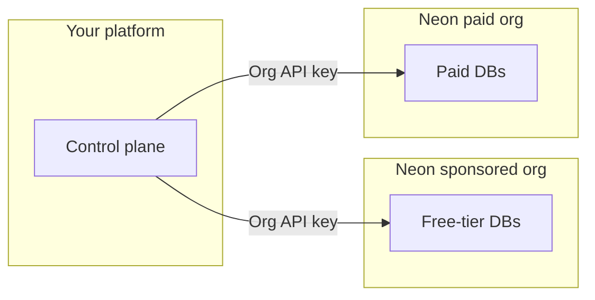

# Neon for Agent Platforms

Sample code and a companion Agent Skill for the [Neon AI Agent Program](https://neon.com/use-cases/ai-agents). It targets products that **provision and operate Neon Postgres for their users** (agent platforms, codegen tools, multi-tenant SaaS).

**Scope:** control-plane and fleet patterns (orgs, provisioning, branching, snapshots, transfer, consumption). For connection strings, drivers, ORMs, and general Neon app integration, use the **neon-postgres** skill and [Neon docs](https://neon.com/docs) first, then this repo for Agent Program orchestration.

Official Neon docs: [Agent Plan](https://neon.com/docs/introduction/agent-plan), [AI Agent integration](https://neon.com/docs/guides/ai-agent-integration), [Database versioning](https://neon.com/docs/ai/ai-database-versioning).

---

## Quick start

### 1. Install the skills

```bash
npx skills add neondatabase/agent-skills -s neon-postgres
npx skills add neondatabase/agent-skills -s neon-postgres-agent-platforms
```

`neon-postgres` covers auth, drivers, branching, Data API, MCP, and core Postgres-on-Neon guidance. `neon-postgres-agent-platforms` adds Agent Program context: dual-org fleets, project transfer, per-tenant provisioning, compound checkpoints, and consumption api.

### 2. Clone and run

```bash
git clone https://github.com/neondatabase/neon-for-agent-platforms.git
cd neon-for-agent-platforms/scripts
npm install
cp .env.example .env
npm run build
# Set NEON_API_KEY (see .env.example)

npm run neon:list-projects
npm run branch -- list
npm run consumption
npm run auth-users -- meta
npm run versioning-flow # NEON_API_KEY + NEON_PROJECT_ID in .env
```

---

## Fleet and org model (summary)

Partners often run **two Neon organizations** (for example sponsored free-tier vs paid). Your control plane chooses **NEON_ORG_ID** per customer tier when creating projects; upgrades may use [project transfer](https://neon.com/docs/manage/orgs-project-transfer) into the paid org. Use **organization API keys** per org and a **personal API key** when moving projects across orgs. Script-level mapping: [MANAGEMENT_API_SAMPLES.md](skills/neon-postgres-agent-platforms/references/MANAGEMENT_API_SAMPLES.md).


| Org                    | Typical role                                                                               |
| ---------------------- | ------------------------------------------------------------------------------------------ |
| **Sponsored free org** | Free-tier end users (within program rules on [neon.com](https://neon.com))                 |
| **Paid org**           | Paying customers (metered per [Agent Plan](https://neon.com/docs/introduction/agent-plan)) |





## Repository layout

```
neon-for-agent-platforms/
├── README.md                          # You are here
├── scripts/                           # *.ts sources → dist/scripts/*.js (npm run build), utils.ts, package.json, tsconfig, .env.example
└── skills/neon-postgres-agent-platforms/
    ├── SKILL.md
    └── references/                    # README = doc index; other *.md + symlinked *.ts (sources in scripts/)
```


| Path                                    | Purpose                                                                                                                              |
| --------------------------------------- | ------------------------------------------------------------------------------------------------------------------------------------ |
| `scripts/`                              | Runnable `[@neondatabase/api-client](https://www.npmjs.com/package/@neondatabase/api-client)` samples                                |
| `skills/neon-postgres-agent-platforms/` | Companion skill — `SKILL.md` + `references/` with detailed docs and symlinked `.ts` sources for agents                               |
| `skills/.../references/README.md`       | **Doc index only** (reading order + symlink table). Does **not** duplicate Quick start; use the **root** `README.md` above for that. |


---

## Reference


| Resource                                                                                               | Notes                                                                                |
| ------------------------------------------------------------------------------------------------------ | ------------------------------------------------------------------------------------ |
| [MANAGEMENT_API_SAMPLES.md](skills/neon-postgres-agent-platforms/references/MANAGEMENT_API_SAMPLES.md) | Script catalog, env vars, flows                                                      |
| [Skill `references/` doc index](skills/neon-postgres-agent-platforms/references/README.md)             | Reading order + symlink table (not Quick start; use this file for clone and scripts) |
| [SKILL.md](skills/neon-postgres-agent-platforms/SKILL.md)                                              | Companion skill for assistants                                                       |
| [Agent Skills repo](https://github.com/neondatabase/agent-skills)                                      | `neon-postgres` bundle                                                               |
| [AI Agent Platforms](https://neon.com/use-cases/ai-agents)                                             | Program overview                                                                     |
| [API reference](https://api-docs.neon.tech)                                                            | Management API                                                                       |


**Requirements:** Node 20+, [Neon API key](https://neon.com/docs/manage/api-keys). Org-scoped keys need `NEON_ORG_ID` — see `.env.example`.

---

## Contributing

From `scripts/`: `npm install`, `npm run build`, `npm run fmt:check`, `npm run typecheck`. Format with `npm run fmt`. See [AGENTS.md](AGENTS.md).

## Support

- Agent Program: shared Slack with Neon
- [agents@neon.tech](mailto:agents@neon.tech) for limits and account requests (include org IDs)
- [neon.com/docs](https://neon.com/docs)

## License

Apache 2.0 — see [LICENSE](skills/neon-postgres-agent-platforms/references/LICENSE).
