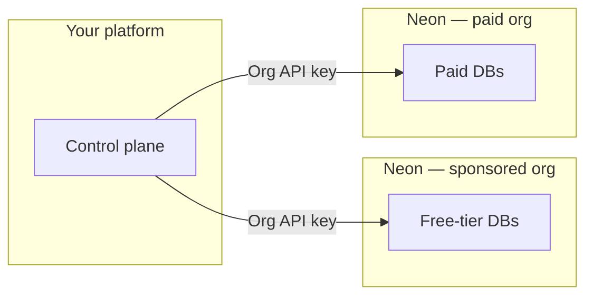

# Neon for Agent Platforms

Sample code and a companion skill for the **[Neon AI Agent Program](https://neon.com/use-cases/ai-agents)**—when **your product** provisions Neon Postgres **for each customer** (agent platforms, codegen tools, multi-tenant SaaS). The companion topic follows the open **[Agent Skills](https://agentskills.io/home)** format ([specification](https://agentskills.io/specification)); this repo adds **runnable `examples/`** beside the skill for partners.

**Official Neon docs (pricing, limits, product behavior):** [neon.com](https://neon.com) — **[Agent Plan](https://neon.com/docs/introduction/agent-plan)** · **[AI Agent integration](https://neon.com/docs/guides/ai-agent-integration)** · **[Database versioning](https://neon.com/docs/ai/ai-database-versioning)**.

---

## Start here (Agent Program partners)

Use this section as the **single entry point** for this repository after Neon has accepted you into the program. Everything else below is background or deep links.

### 1. Accounts, orgs, and keys

Agent Program partners typically use **two Neon organizations** (free-tier users vs paying customers). Store **both org IDs**, **organization API keys** for automation inside each org, and a **personal API key** for **[project transfer](https://neon.com/docs/manage/orgs-project-transfer)** between orgs. Follow **[Before you begin](https://neon.com/docs/guides/ai-agent-integration)** in the integration guide.

### 2. Match your product to scripts

Pick the route that fits your product, then use the checklists and script names in **[docs/AGENT_USE_CASES.md](docs/AGENT_USE_CASES.md)**:


| Route       | Product shape                                                     | Start in                                                                                           |
| ----------- | ----------------------------------------------------------------- | -------------------------------------------------------------------------------------------------- |
| **Route 1** | Postgres **inside your product** (embedded, ephemeral, sandboxes) | [§ Route 1](docs/AGENT_USE_CASES.md#route-1--your-product-deploys-embedded-postgres)               |
| **Route 2** | **Generated apps** each get their own DB (codegen, starter kits)  | [§ Route 2](docs/AGENT_USE_CASES.md#route-2--full-stack-codegen-every-generated-app-gets-postgres) |


All runnable samples live under `**examples/api-scripts/`** (Neon Console Management API). For fleet-wide **two-org** mental model and which script to run when, read **[examples/FLEET_AND_ORG_LAYOUT.md](examples/FLEET_AND_ORG_LAYOUT.md)**.

### 3. Clone and run the examples

```bash
git clone https://github.com/neondatabase/neon-for-agent-platforms.git
cd neon-for-agent-platforms/examples/api-scripts
npm install
cp .env.example .env
# Node 20+: load vars from .env — see .env.example for each script
node --env-file=.env create-project.mjs
node --env-file=.env branch.mjs list
node --env-file=.env consumption-query.mjs
node --env-file=.env auth-users.mjs meta
```

**Snapshots + restore (database versioning):**

```bash
# NEON_API_KEY + NEON_PROJECT_ID in .env
node --env-file=.env versioning-flow.mjs
# Optional: DEMO_MUTATE=1 for a visible restore demo
```

**Full script list, env vars, and commands:** [examples/api-scripts/README.md](examples/api-scripts/README.md) · **Routing** (Auth users vs Postgres roles vs consumption): [docs/REST_API_META.md](docs/REST_API_META.md).

### 4. AI assistants in your editor (recommended)

Install Neon’s baseline skill, then this repo’s Agent Program companion:

```bash
npx skills add neondatabase/agent-skills -s neon-postgres
npx skills add neondatabase/agent-skills -s neon-postgres-agent-platforms
```

Or bootstrap skills + MCP: `npx neonctl@latest init` — [Agent Skills on Neon](https://neon.com/docs/ai/agent-skills).

---

## What’s in this repository

### Layout (Agent Skills + examples)

The **[Agent Skills directory model](https://agentskills.io/home#what-are-agent-skills)** is: `SKILL.md` + optional `scripts/`, `references/`, `assets/`. This repo implements that under `**skills/neon-postgres-agent-platforms/`** and also ships **Management API sample code** at the root for the Agent Program (not duplicated inside the skill folder). Details: `**[skills/README.md](skills/README.md)`**.

```
neon-for-agent-platforms/
├── examples/
│   └── api-scripts/          # Runnable Node samples (Console API) — partner engineering
├── skills/
│   ├── README.md
│   └── neon-postgres-agent-platforms/   # Agent Skills–shaped companion topic
│       ├── SKILL.md
│       ├── references/
│       ├── scripts/          # See scripts/README (automation lives in examples/)
│       └── assets/           # See assets/README (optional; env patterns in examples)
└── docs/
```


| Path                                             | Purpose                                                                                                                                                                                                                                                                         |
| ------------------------------------------------ | ------------------------------------------------------------------------------------------------------------------------------------------------------------------------------------------------------------------------------------------------------------------------------- |
| `[examples/api-scripts/](examples/api-scripts/)` | **Runnable samples** — `fetch` to `console.neon.tech/api/v2`; shared `[lib/neon-client.mjs](examples/api-scripts/lib/neon-client.mjs)`.                                                                                                                                         |
| `[skills/](skills/README.md)`                    | **Agent Skills layout** — companion `[neon-postgres-agent-platforms](skills/neon-postgres-agent-platforms/)` (`**[SKILL.md](skills/neon-postgres-agent-platforms/SKILL.md)`** + `references/`). Use **with** **[neon-postgres](https://github.com/neondatabase/agent-skills)**. |
| `[docs/](docs/)`                                 | [Agent use cases](docs/AGENT_USE_CASES.md) · [REST API meta](docs/REST_API_META.md) · [In-repo link index](docs/AGENT_PROGRAM_REFERENCE.md) · [Partner post-call note](docs/NEON_AGENT_PROGRAM_POST_CALL_GUIDE.md)                                                              |


Hub for `examples/`: [examples/README.md](examples/README.md).

---

## Program model (reference)

### Two Neon organizations


| Org                    | Who it serves                                           |
| ---------------------- | ------------------------------------------------------- |
| **Sponsored free org** | Your free-tier users (within program rules on neon.com) |
| **Paid org**           | Paying customers (metered per Agent Plan)               |


Your control plane chooses **which org** when creating a tenant project. Upgrades often mean **[transferring](https://neon.com/docs/manage/orgs-project-transfer)** the project into the paid org and **raising quotas**.

### API keys (two kinds)

- **Organization API key** — automate work **inside one** org.
- **Personal API key** — required to **transfer** a project **between** orgs.

### One project per tenant

Neon’s recommended pattern is **one Neon project per customer app**. Details: **[AI Agent integration guide](https://neon.com/docs/guides/ai-agent-integration)**.




---

## Further reference


| Resource                                                             | Use when                                                   |
| -------------------------------------------------------------------- | ---------------------------------------------------------- |
| [Examples hub](examples/README.md)                                   | Short map of `api-scripts` + cross-links                   |
| [Fleet & org layout](examples/FLEET_AND_ORG_LAYOUT.md)               | Two-org flows: create → transfer → consume → delete        |
| [REST API meta](docs/REST_API_META.md)                               | Neon Auth `/users` vs DB roles vs `consumption_history/v2` |
| [Partner post-call note](docs/NEON_AGENT_PROGRAM_POST_CALL_GUIDE.md) | Condensed links; program model is above                    |
| [Agent Plan](https://neon.com/docs/introduction/agent-plan)          | Pricing, credits, two-org model                            |
| [Agent Skills repo](https://github.com/neondatabase/agent-skills)    | `neon-postgres` bundle                                     |


---

## Contributing

Lint and format for `examples/**/*.mjs`: repo root — `npm install`, `npm run lint`, `npm run format:check` (aliases `**npm run fmt**` / `**npm run fmt:check**`). Agent guidance: **[AGENTS.md](AGENTS.md)**.

---

## Support

- **Shared Slack channel** — Agent Program participants get direct access to the Neon team
- **Email** — [agents@neon.tech](mailto:agents@neon.tech) for limit increases and account requests (include org IDs and context)
- **Docs** — [neon.com/docs](https://neon.com/docs) · [API reference](https://api-docs.neon.tech)

## License

Apache 2.0 — [LICENSE](LICENSE)