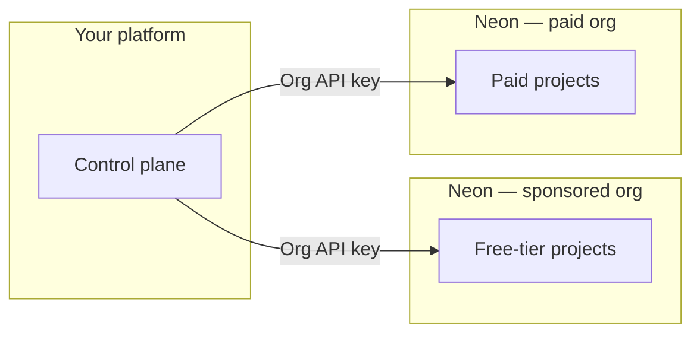

# Neon for Agent Platforms

Sample code and a companion Agent Skill for the
**[Neon AI Agent Program](https://neon.com/use-cases/ai-agents)**.

This repo is for products that **provision and operate Neon Postgres on behalf
of their users**, such as agent platforms, codegen tools, generated-app
platforms, and multi-tenant SaaS.

The companion skill follows the open
**[Agent Skills](https://agentskills.io/home)** format
([specification](https://agentskills.io/specification)). This repository adds
runnable `examples/` beside that skill for Agent Program customers and partners.

## Scope

This repo covers Agent Program control-plane and fleet-management patterns:

- Organization layout
- Provisioning at scale
- Branching, snapshots, and versioning
- Project transfer
- Consumption and metering
- Orchestration hooks
- Safe mutation of user-owned Neon resources

It does **not** cover introductory Neon app usage. Connection strings, drivers,
Drizzle/ORM setup, generic branching tutorials, and everyday Neon Auth
application integration belong in the `neon-postgres` skill and the
[Neon docs](https://neon.com/docs).

Install `neon-postgres` first, then use this repo for Agent Program-specific
orchestration.

## Official docs

For pricing, limits, and product behavior, use the official Neon docs as the
source of truth:

- [Agent Plan](https://neon.com/docs/introduction/agent-plan)
- [AI Agent integration guide](https://neon.com/docs/guides/ai-agent-integration)
- [Database versioning](https://neon.com/docs/ai/ai-database-versioning)
- [Neon docs](https://neon.com/docs)

---

## Start here

Use this section after Neon accepts you into the Agent Program. Later sections
add more detail and map the model to scripts in this repo.

### 1. Accounts, orgs, and keys

Agent Program customers typically use two Neon organizations:

- A sponsored/free organization for free-tier users
- A paid organization for paying customers

Your control plane should store:

- Both organization IDs
- Organization API keys for automation inside each org
- A personal API key for
  [project transfer](https://neon.com/docs/manage/orgs-project-transfer)
  between orgs

Follow
[Before you begin](https://neon.com/docs/guides/ai-agent-integration) in the
AI Agent integration guide before running the fleet examples.

### 2. Choose your fleet model

Most Agent Program customers map their product to one of these fleet models.
Script names and env vars are documented in
[examples/api-scripts/MANAGEMENT_API_SCRIPTS.md](examples/api-scripts/MANAGEMENT_API_SCRIPTS.md).

- **Embedded Postgres in your product** — for sandboxes, previews, agent
  workspaces, and generated apps. Use the scripts for project creation,
  branching, snapshots/restores, versioning, and cleanup.
- **One Neon project per generated or customer app** — for products where each
  app, tenant, or deployment gets isolated Neon resources. Align naming,
  lifecycle, quotas, and transfers with Neon’s
  [AI Agent integration guide](https://neon.com/docs/guides/ai-agent-integration).

**Routing note:** Neon Auth users, Postgres roles, and consumption metrics are
different APIs. Neon Auth app users live under
[`…/auth/users`](https://neon.com/docs/neon-auth/api); Postgres roles are
[connection users](https://neon.com/docs/manage/users); consumption and billing
data comes from
[consumption metrics](https://neon.com/docs/guides/consumption-metrics). Run
`auth-users.ts meta` for a short routing summary.

For fleet two-org patterns such as create → transfer → consume → delete, see
[Fleet provisioning with the Management API](#fleet-provisioning-with-the-management-api).

### 3. Clone and run the examples

These examples call the Neon Management API and may create or delete real Neon
resources. Use a test org or test project while learning the flows.

```bash
git clone https://github.com/neondatabase/neon-for-agent-platforms.git
cd neon-for-agent-platforms/examples/api-scripts
npm install
cp .env.example .env

# Node 20+: load vars from .env — see .env.example for each script
node --env-file=.env --import tsx/esm create-project.ts
node --env-file=.env --import tsx/esm branch.ts list
node --env-file=.env --import tsx/esm consumption-query.ts
node --env-file=.env --import tsx/esm auth-users.ts meta
```

Snapshots and restore:

```bash
# NEON_API_KEY + NEON_PROJECT_ID in .env
node --env-file=.env --import tsx/esm versioning-flow.ts

# Optional: DEMO_MUTATE=1 for a visible restore demo
```

Full script list, env vars, and commands:
[examples/api-scripts/MANAGEMENT_API_SCRIPTS.md](examples/api-scripts/MANAGEMENT_API_SCRIPTS.md).

### 4. AI assistants in your editor

Install Neon’s baseline skill first, then this repo’s Agent Program companion
skill:

```bash
npx skills add neondatabase/agent-skills -s neon-postgres
npx skills add neondatabase/neon-for-agent-platforms -s neon-postgres-agent-platforms
```

Or bootstrap Neon skills and MCP with:

```bash
npx neonctl@latest init
```

See [Agent Skills on Neon](https://neon.com/docs/ai/agent-skills).

---

## What’s in this repository

This repo contains two things:

1. An Agent Skills-shaped companion topic in
   `skills/neon-postgres-agent-platforms/`
2. Runnable TypeScript examples in `examples/api-scripts/`

The examples live at the repository root, beside the skill, rather than inside
the skill folder.

```text
neon-for-agent-platforms/
├── examples/
│   └── api-scripts/                    # Runnable TypeScript samples
└── skills/
    └── neon-postgres-agent-platforms/  # Agent Skills-shaped companion topic
        ├── SKILL.md
        ├── references/
        ├── scripts/
        └── assets/
```

| Path | Purpose |
| --- | --- |
| [`examples/api-scripts/`](examples/api-scripts/) | Runnable TypeScript samples for the Neon Management API using [`@neondatabase/api-client`](https://www.npmjs.com/package/@neondatabase/api-client) and `tsx`. See [MANAGEMENT_API_SCRIPTS.md](examples/api-scripts/MANAGEMENT_API_SCRIPTS.md). |
| [`skills/neon-postgres-agent-platforms/`](skills/neon-postgres-agent-platforms/) | Companion Agent Skill with [SKILL.md](skills/neon-postgres-agent-platforms/SKILL.md) and references. Use alongside [`neon-postgres`](https://github.com/neondatabase/agent-skills). |

---

## Program model

Neon Agent Plan customers typically use:

- **Two Neon organizations**: one sponsored/free org and one paid org
- **One Neon project per customer app, tenant, or agent workspace**
- **Organization API keys** for automation within each org
- **A personal API key** for transferring projects between orgs

Your control plane chooses the target org when provisioning a tenant project.
When a user upgrades, your control plane can transfer the project from the
sponsored org to the paid org and adjust quotas.



---

## Fleet provisioning with the Management API

This section maps the Agent Program control-plane model to scripts in
`examples/api-scripts/`.

These scripts are building blocks. In production, your control plane should wrap
the same operations with queues, durable records, retries, and idempotency.

### 1. Organization layout

| Org role | Typical use | You store |
| --- | --- | --- |
| **Sponsored/free org** | Free-tier end users, within program rules | Free org ID and an org-scoped API key |
| **Paid org** | Paying customers and higher quotas | Paid org ID and an org-scoped API key |

Your control plane decides which `org_id` to pass when creating a project for a
new tenant. The same `create-project.ts` call is used for both orgs; only the
target `NEON_ORG_ID` and loaded API key change.

### 2. API keys

| Key type | Scope | Fleet provisioning use |
| --- | --- | --- |
| **Organization API key** | Single org | Use one key per org in production, for example `NEON_API_KEY_FREE` and `NEON_API_KEY_PAID`, or swap `.env` per job. Each `create-project` run should target the org matching the key. |
| **Personal API key** | Can act across orgs you belong to | Required for `transfer-project.ts` when moving a project from the free org to the paid org. |

Details:
[Transfer projects between organizations](https://neon.com/docs/manage/orgs-project-transfer).

### 3. Fleet operations

| Fleet goal | Script | Notes |
| --- | --- | --- |
| **Provision** a new tenant DB | [`create-project.ts`](examples/api-scripts/create-project.ts) | Set `NEON_ORG_ID` for the customer tier. Set `NEON_PROJECT_NAME`, for example `tenant-{customerId}`. Output includes `projectId` and `DATABASE_URL`; persist both. |
| **Offboard** or destroy a tenant | [`delete-project.ts`](examples/api-scripts/delete-project.ts) | Requires `NEON_PROJECT_ID`. |
| **Upgrade tier** from free org to paid org | [`transfer-project.ts`](examples/api-scripts/transfer-project.ts) | Requires `NEON_SOURCE_ORG_ID`, `NEON_DESTINATION_ORG_ID`, and `NEON_PROJECT_ID` or `NEON_PROJECT_IDS`. Uses a personal API key with transfer permissions. After transfer, raise quotas per Neon docs. |
| **Observe usage** across projects | [`consumption-query.ts`](examples/api-scripts/consumption-query.ts) | Requires `NEON_ORG_ID` and a time range. Use `CONSUMPTION_PROJECT_IDS` to slice the fleet. |
| **Manage branches and versioning** per tenant | [`branch.ts`](examples/api-scripts/branch.ts), [`versioning-flow.ts`](examples/api-scripts/versioning-flow.ts), [`snapshot.ts`](examples/api-scripts/snapshot.ts) | Use for per-tenant sandboxes, previews, restores, and versioned app states. Keep `project_id`, branch IDs, and snapshot IDs in your own ledger. |

Full env reference:
[examples/api-scripts/MANAGEMENT_API_SCRIPTS.md](examples/api-scripts/MANAGEMENT_API_SCRIPTS.md).

For conceptual branching tutorials, use the `neon-postgres` skill and the
[branching docs](https://neon.com/docs/guides/branching). This repo focuses on
fleet-scale Management API calls.

### 4. Practical patterns

1. **Per-tier provisioning** — When a user signs up on a free plan, call
   `create-project` with the free `NEON_ORG_ID` and your naming convention.
   When they convert to paid, either provision a new project in the paid org or
   transfer the existing project and adjust quotas.
2. **Secrets layout** — Common production layouts include one worker with
   `NEON_API_KEY`, `NEON_ORG_ID_FREE`, and `NEON_ORG_ID_PAID`, or separate
   `NEON_API_KEY_FREE` and `NEON_API_KEY_PAID` secrets. Match the API key to
   the org ID used for each request.
3. **Idempotency and bookkeeping** — This repo prints JSON. Your fleet layer
   should persist `project_id` ↔ `customer_id`, store branch/snapshot IDs, and
   handle partial failures. Neon operations are asynchronous; the helper in
   [`lib/neon-client.ts`](examples/api-scripts/lib/neon-client.ts) waits on
   initial operations where needed.

### 5. What is not automated here

- **Quota updates after transfer** — follow the
  [AI Agent integration guide](https://neon.com/docs/guides/ai-agent-integration)
  or Console; these scripts do not duplicate that flow.
- **Rate limits and project caps** — contact
  [agents@neon.tech](mailto:agents@neon.tech) per Agent Program; see
  [Support](#support).

Also see:

- [Compound checkpoints](examples/api-scripts/references/COMPOUND_CHECKPOINTS_FOR_AGENT_PLATFORMS.md)
- [Database versioning](https://neon.com/docs/ai/ai-database-versioning)
- [`neon-postgres`](https://github.com/neondatabase/agent-skills)

---

## API routing quick refs

Use the right API surface for the job:

| Topic | Reference |
| --- | --- |
| Neon Auth users | [Neon Auth API](https://neon.com/docs/neon-auth/api) |
| Postgres roles / connection users | [Manage roles](https://neon.com/docs/manage/users) |
| Consumption and billing metrics | [Consumption metrics](https://neon.com/docs/guides/consumption-metrics) |
| Management API | [API reference](https://api-docs.neon.tech) |

---

## Requirements

- Node.js 20+ recommended for `node --env-file=.env`
- Neon [API key](https://neon.com/docs/manage/api-keys)
- `NEON_ORG_ID` where required by org-scoped operations
- Agent Program enrollment for program-specific org layout, limits, and support

---

## Further reference

| Resource | Use when |
| --- | --- |
| [Management API scripts](examples/api-scripts/MANAGEMENT_API_SCRIPTS.md) | Script catalog, env vars, typical flows, and `neon-client.ts` behavior |
| [AI Agent integration guide](https://neon.com/docs/guides/ai-agent-integration) | Recommended Agent Program implementation model |
| [Agent Plan](https://neon.com/docs/introduction/agent-plan) | Pricing, credits, limits, and program details |
| [Database versioning](https://neon.com/docs/ai/ai-database-versioning) | Snapshots, restores, preview branches, and checkpointing |
| [Agent Skills repo](https://github.com/neondatabase/agent-skills) | `neon-postgres` baseline skill |
| [AI Agent Platforms](https://neon.com/use-cases/ai-agents) | Apply / program overview on neon.com |
| [Neon docs](https://neon.com/docs) | General Neon product documentation |

---

## Contributing

Format and typecheck the TypeScript examples:

```bash
npm install
npm run fmt:check
npm run typecheck
```

Format files:

```bash
npm run fmt
```

Agent guidance: [AGENTS.md](AGENTS.md).

---

## Support

- **Shared Slack channel** — Agent Program participants get direct access to the
  Neon team.
- **Email** — [agents@neon.tech](mailto:agents@neon.tech) for limit increases
  and account requests. Include org IDs and context.
- **HIPAA on Agent Plan** — Requirements and enablement:
  [HIPAA on Neon](https://neon.com/docs/security/hipaa). Contact your Neon
  representative.
- **Docs** — [neon.com/docs](https://neon.com/docs) and
  [API reference](https://api-docs.neon.tech).

## License

Apache 2.0 — [LICENSE](LICENSE)
