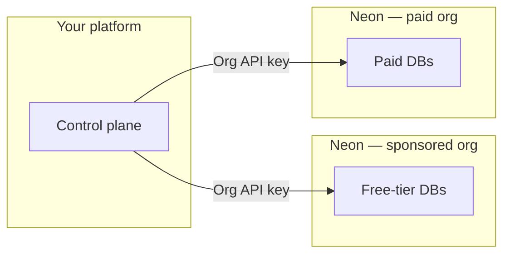

# Neon for Agent Platforms

Sample code and an AI skill topic for the **[Neon AI Agent Program](https://neon.com/use-cases/ai-agents)**—when **your product** provisions Neon Postgres **for each customer** (agent platforms, codegen tools, multi-tenant SaaS).

**Official product docs:** [neon.com](https://neon.com) — start with [**Agent Plan**](https://neon.com/docs/introduction/agent-plan) and [**AI Agent integration**](https://neon.com/docs/guides/ai-agent-integration).

---

## How this repo relates to the Agent Program

### Two Neon organizations

Partner programs typically use **two orgs** so free-tier users and paying customers land in the right billing context:

| Org | Who it serves |
|-----|----------------|
| **Sponsored free org** | Your free-tier users (within program rules on neon.com) |
| **Paid org** | Paying customers (metered per Agent Plan) |

Your control plane chooses **which org** when creating a tenant project. Upgrades often mean [**transferring**](https://neon.com/docs/manage/orgs-project-transfer) the project into the paid org and **raising quotas**; downgrades reverse that within free-tier caps.

### API keys (two kinds)

- **Organization API key** — automate work **inside one** org (create projects, branches, etc.).
- **Personal API key** — required to **transfer** a project **between** orgs (you must have access to both orgs). See the [org project transfer](https://neon.com/docs/manage/orgs-project-transfer) doc.

### One project per tenant

Neon’s recommended pattern is **one Neon project per customer app** so isolation and metering line up with Agent Plan quotas. Details: [**AI Agent integration guide**](https://neon.com/docs/guides/ai-agent-integration).



### What’s in this repository

**Start here for runnable samples:** [`examples/README.md`](examples/README.md) (hub) · **[`examples/minimal-node/README.md`](examples/minimal-node/README.md)** · **[`examples/api-scripts/README.md`](examples/api-scripts/README.md)** (every script, env vars, flows).

| Path | Purpose |
|------|--------|
| [`examples/minimal-node/`](examples/minimal-node/) | Smallest path: **provision** a project (optional) and run a **query** with `pg` + `DATABASE_URL`. |
| [`examples/api-scripts/`](examples/api-scripts/) | **REST** (`fetch` to `console.neon.tech/api/v2`): create/delete project, branches, **snapshot + restore** ([database versioning](https://neon.com/docs/ai/ai-database-versioning)), org **transfer**, **consumption** history, Neon **Auth** users; shared [`lib/neon-client.mjs`](examples/api-scripts/lib/neon-client.mjs). Run **`npm run versioning-flow`** for the full demo. For “Auth REST vs Postgres roles vs billing metrics”, see [`docs/REST_API_META.md`](docs/REST_API_META.md). |
| [`skills/neon-postgres-agent-platforms/`](skills/neon-postgres-agent-platforms/) | Companion **Cursor/agent skill** topic—Agent Program context (orgs, transfers, fleet patterns, costs). Use **with** [`neon-postgres`](https://github.com/neondatabase/agent-skills), not instead of it. |
| [`docs/`](docs/) | [`AGENT_PROGRAM_REFERENCE.md`](docs/AGENT_PROGRAM_REFERENCE.md) (link index), [`REST_API_META.md`](docs/REST_API_META.md), [`NEON_AGENT_PROGRAM_POST_CALL_GUIDE.md`](docs/NEON_AGENT_PROGRAM_POST_CALL_GUIDE.md) (short partner note + extra links). |

### First steps after you join the program

1. Store **both org IDs**, **org API keys**, and a **personal API key** where your automation needs them ([Before you begin](https://neon.com/docs/guides/ai-agent-integration) in the integration guide).
2. Ship **create project** + connection string for one tier; route **free org vs paid org** from your control plane.
3. Test **transfer** + quota update on a customer upgrade path.
4. Install **`neon-postgres`** (and this repo’s companion skill—see below) so assistants answer day-to-day Neon questions accurately.

---

## Quick start (clone and run)

### 1. Provision a project

```bash
git clone https://github.com/neondatabase/neon-for-agent-platforms.git
cd neon-for-agent-platforms/examples/minimal-node
npm install
cp .env.example .env
```

Add your `NEON_API_KEY` to `.env`, then:

```bash
npm run provision
```

This creates a Neon project and returns a connection string.

### 2. Connect and query

Add the `DATABASE_URL` from step 1 to `.env`, then:

```bash
npm run start
```

If you already have a database, skip step 1 and set `DATABASE_URL` in `.env` (from the Neon Console), then `npm run start`.

### 3. REST scripts (create / delete / branch / snapshot / transfer)

Uses `fetch` against `console.neon.tech/api/v2`. Install once in this folder (`pg` is used only for the optional SQL step in the versioning demo):

```bash
cd neon-for-agent-platforms/examples/api-scripts
npm install
cp .env.example .env
# Node 20+: load vars from .env
node --env-file=.env create-project.mjs
node --env-file=.env branch.mjs list
node --env-file=.env consumption-query.mjs
node --env-file=.env auth-users.mjs meta
```

**Database versioning (snapshots + restore):** end-to-end flow — baseline snapshot → child branch → optional mutation → second snapshot → **restore** baseline onto the branch ([docs](https://neon.com/docs/ai/ai-database-versioning)):

```bash
cd neon-for-agent-platforms/examples/api-scripts
npm install
# NEON_API_KEY + NEON_PROJECT_ID in .env
node --env-file=.env versioning-flow.mjs
# Optional: DEMO_MUTATE=1 inserts a row so restore visibly rewinds the demo branch
```

One-off restore: `node --env-file=.env restore-snapshot.mjs` with `NEON_SNAPSHOT_ID` and `NEON_TARGET_BRANCH_ID`.

See [`examples/api-scripts/.env.example`](examples/api-scripts/.env.example) for variables per script. **Full reference:** [`examples/api-scripts/README.md`](examples/api-scripts/README.md).

### 4. Install Neon’s AI skills

**Baseline:** full Neon platform coverage for assistants — **[github.com/neondatabase/agent-skills](https://github.com/neondatabase/agent-skills)**:

```bash
npx skills add neondatabase/agent-skills -s neon-postgres
```

Or bootstrap skills + MCP: `npx neonctl@latest init`

**Agent Program & agent platforms:** add the companion topic **after** `neon-postgres`. Required when you provision Postgres per customer—org layout, transfers, fleet patterns, quotas, cost guidance:

```bash
npx skills add neondatabase/agent-skills -s neon-postgres-agent-platforms
```

Use **both** together for agent-platform work. Teams using Neon only for generic apps without per-user provisioning can stop at `neon-postgres`.

---

## Key docs

| Resource | Description |
|----------|-------------|
| [Examples hub](examples/README.md) | **`minimal-node`** vs **`api-scripts`**, links to per-folder READMEs |
| [Link index (this repo)](docs/AGENT_PROGRAM_REFERENCE.md) | In-repo docs and external entry points |
| [REST API meta](docs/REST_API_META.md) | Neon Auth users vs Postgres roles vs consumption `v2` |
| [Partner note](docs/NEON_AGENT_PROGRAM_POST_CALL_GUIDE.md) | Short post-call addendum (HIPAA row, extra links)—**program model and repo map are above** |
| [Agent Plan](https://neon.com/docs/introduction/agent-plan) | Pricing, credits, two-org model |
| [Integration guide](https://neon.com/docs/guides/ai-agent-integration) | Provisioning, quotas, transfers, versioning |
| [Database versioning](https://neon.com/docs/ai/ai-database-versioning) | Snapshots and checkpoints |
| [Agent Skills](https://github.com/neondatabase/agent-skills) | `neon-postgres` skill bundle |

---

## Support

- **Shared Slack channel** — Agent Program participants get direct access to the Neon team
- **Email** — [agents@neon.tech](mailto:agents@neon.tech) for limit increases and account requests (include org IDs and context)
- **Docs** — [neon.com/docs](https://neon.com/docs) · [API reference](https://api-docs.neon.tech)

## License

Apache 2.0 — [LICENSE](LICENSE)
