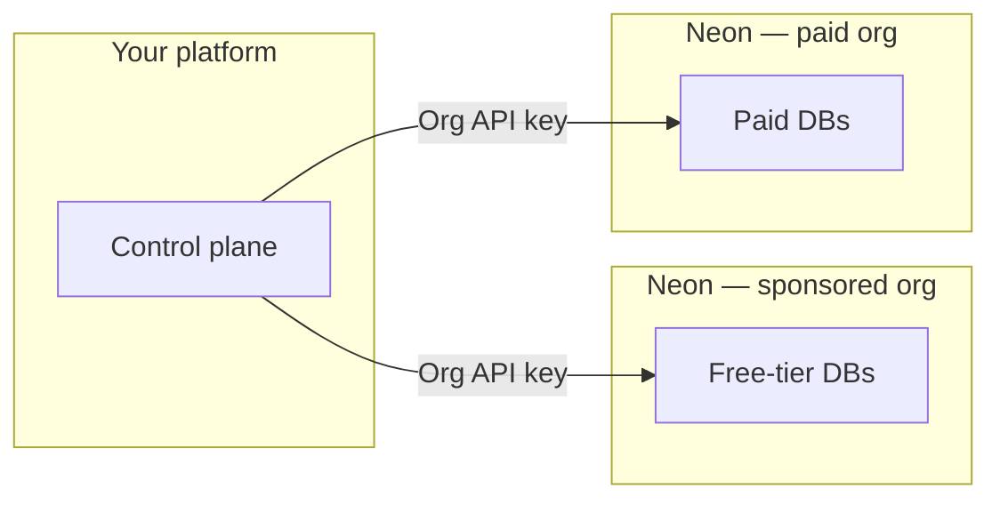

# Neon AI Agent Program — Partner builder guide

For teams where **AI or automation provisions Postgres for end users**. This page stays **narrow**: what’s specific to the **Agent Program** (two Neon orgs, transfers, mini code sample). Everything else—connections, Auth, Data API, toolkit, MCP, consumption API details, branching deep dives—is covered by **Neon’s main Agent Skill** (`neon-postgres`) and [**neon.com**](https://neon.com); we don’t duplicate that here.

**Official source of truth:** [neon.com](https://neon.com) — especially [**Agent Plan**](https://neon.com/docs/introduction/agent-plan) and [**AI Agent integration guide**](https://neon.com/docs/guides/ai-agent-integration).

---

## Use Neon’s Agent Skill for general Neon (don’t duplicate here)

Install Neon's primary skill so assistants know Auth, Data API, `@neondatabase/toolkit`, MCP, consumption APIs, branching, drivers, etc.:

```bash
npx skills add neondatabase/agent-skills -s neon-postgres
```

Or bootstrap skills + MCP in one step: **`npx neonctl@latest init`** — see [**Agent Skills**](https://neon.com/docs/ai/agent-skills).

**This repo’s skill** (`neon-postgres-agent-platforms`) only adds: **Agent Program org model** + **summaries of the mini repo** below—not a second copy of `neon-postgres`.

---

## Mini reference implementation (smallest code sample)

[**github.com/neondatabase/neon-for-agent-platforms**](https://github.com/neondatabase/neon-for-agent-platforms) → [`examples/minimal-node`](https://github.com/neondatabase/neon-for-agent-platforms/tree/main/examples/minimal-node): `DATABASE_URL`, `@neondatabase/serverless`, one query. Install this **program-specific** skill if you want that snippet + org Q&A in the assistant:

```bash
npx skills add neondatabase/agent-skill -s neon-postgres-agent-platforms
```

(`neondatabase/agent-skills` if your toolchain uses that package.)

---

## What’s specific to the Agent Program

**1. Two Neon organizations**

| Org | Serves |
|-----|--------|
| **Sponsored free org** | *Your* free-tier customers (Neon-sponsored within program rules on the site) |
| **Paid org** | Paying customers (metered per Agent Plan) |

**2. Keys**

- **Organization API key** — automate inside **one** org.  
- **Personal API key** — required to **transfer** a project between orgs ([**transfer**](https://neon.com/docs/manage/orgs-project-transfer)).

**3. Typical lifecycle**

- Create tenant projects in the **right org** → upgrade path: **transfer** to paid org → **raise quotas**; downgrade: transfer back and lower quotas (fit free-tier caps).

**4. Project-per-user**

Neon’s documented pattern is **one Neon project per tenant app** ([**integration guide**](https://neon.com/docs/guides/ai-agent-integration)). Isolation and metering match how Agent Plan quotas work.



**Versioning, checkpoints, dev/prod, billing APIs, cost drivers** — follow the [**AI Agent integration guide**](https://neon.com/docs/guides/ai-agent-integration) and ask an assistant with **`neon-postgres`** installed; limits and rates stay on live docs.

**Optional larger example app:** [Aileen](https://github.com/andrelandgraf/aileen)

---

## Links

| Topic | Where |
|-------|--------|
| Plan & benefits | [**Agent Plan**](https://neon.com/docs/introduction/agent-plan) |
| Apply | [**AI Agent Platforms**](https://neon.com/use-cases/ai-agents) · [**neon.com/agents**](https://neon.com/agents) |
| Implementation (provision, quotas, versioning, billing hooks) | [**AI Agent integration guide**](https://neon.com/docs/guides/ai-agent-integration) |
| Auth, Data API, toolkit, MCP, drivers, Agent Skills | [**Agent Skills**](https://neon.com/docs/ai/agent-skills) + **`neon-postgres`** |
| **Higher project (or org) limits** | Email [**agents@neon.tech**](mailto:agents@neon.tech) with org ID(s) and context—confirm against live docs; keep using shared Slack if you have it |
| **HIPAA (Agent Plan)** | Included **without an additional charge** on the Agent Plan. To get access, contact your **main Neon contact**. Requirements and setup: [**HIPAA on Neon**](https://neon.com/docs/security/hipaa) |

---

## First month (short)

1. Store **both org IDs**, **org API keys**, **personal API key** ([**Before you begin**](https://neon.com/docs/guides/ai-agent-integration)).  
2. Ship **create project** + connection string for one tier; route **free org vs paid org**.  
3. Test **transfer** + quota update on upgrade.  
4. Use **`neon-postgres`** / **neonctl init** for day-to-day Neon questions in your editor.

---

*When in doubt: [**neon.com**](https://neon.com), your Neon contact, or [**agents@neon.tech**](mailto:agents@neon.tech) for Agent Program org/project limit requests.*
